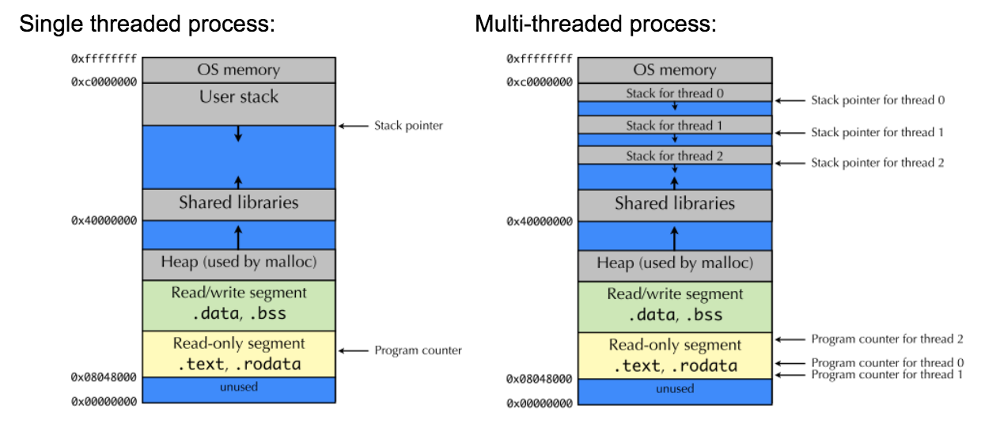

#### Race condition
* 서로 다른 스레드나 프로그램이 같은 자원에 동시에 접근해서 접근 순서에 따라 결과가 달라지는 문제

#### 임계영역(Critical Section)
* 공유 데이터의 일관성을 보장하기 위해 하나의 프로세스/스레드만 진입해서 실행 가능한 영역

#### 뮤텍스 & 세마포어
* 공통점 : 상호배제(한 번에 하나의 프로세스/스레드만 자원을 사용)방식으로 동기화를 함.
* 뮤텍스
  * 락을 가질 수 있을 때까지 대기 큐에서 sleep(휴식) 한다.
  * CPU연산을 사용하지 않는 대기
  * 공유자원에 한 번에 하나의 스레드만 접근할 수 있다.
* 세마포어
  * 공유자원에 한 번에 정수 n개 만큼 스레드가 접근할 수 있다.
* 단점 : 잘못 사용시 교착상태(데드락) 발생 가능할 수 있음.

#### 병렬 프로그래밍에서 Race condition 이 발생하지 않는 조건
1. 상호배제(Mutual Exclusion)
   * 한 번에 하나의 프로세스만 자원을 사용한다.
   * 뮤텍스, 세마포어, 모니터와 같은 동기화 메커니즘을 사용해서 구현함.
2. 유효한 진행(Progress)
   * 자원이 사용 가능할 때, 자원을 요청한 프로세스는 접근할 수 있다.
3. 유한 대기(Bounded waiting)
   * 자원에 접근하려는 프로세스는, 무한정 기다리지 않도록 보장한다.

#### 교착상태(Dead-Lock)
* 프로세스/스레드가 자원을 서로 점유하고, 다른 자원이 해제되기를 영원히 기다리게 되는 것.
* 다음 네가지 조건을 동시에 만족할 때, 발생한다.
  ```angular2html
  1. 상호 배제(mutual Exclusion) : 자원이 한 번에 하나의 프로세스만 사용 가능할 때.(자원이 공유되지 못할 때)
  2. 점유 대기(hold and wait) : 자원을 점유한 상태에서 프로세스가 다른 자원을 요청할 때.
  3. 비선점(No preemption) : 프로세스가 점유한 자원을 강제로 뺏어오지 못할 때.
  4. 순환 대기(circular wait) : 자원을 기다리는 프로세스들이 원형으로 순환할 때.
  ```

#### 컨텍스트 스위칭
* CPU에서 한 프로세스나 쓰레드가 다른 프로세스나 쓰레드로 교체되는 것.
* 왜 프로세스에서 더 무거울까?
  * 프로세스는 독립된 메모리 공간을 갖고 있으며, 여러 개의 쓰레드로 이루어져 있다.
  * 그렇기에 다른 프로세스로 전환되려면 CPU가 이전 프로세스에서 실행되고 있는 수 많은 쓰레드의 값들을 레지스터에 저장해야 함.
  * CPU가 현재 프로세스의 주소 공간을 저장하고, 다음 프로세스의 주소 공간을 로드 -> 새로운 메모리 주소가 로드되기 때문에 CPU(엄밀히 말하면 제어 장치)의 캐시 히트율이 적어짐.
  * 프로세스 간의 교체는 메모리 주소 관련해서 처리가 일어날 수 밖에 없지만(프로세스는 독립된 메모리 공간을 사용), 스레드끼리는 같은 메모리 주소 공간을 사용하기 때문
  * 
  * https://www.google.com/url?sa=i&url=https%3A%2F%2Fcs61.seas.harvard.edu%2Fwiki%2F2017%2FSection12%2F&psig=AOvVaw0iVzgUWqmKWVC3Y3c_FCTl&ust=1721353152183000&source=images&cd=vfe&opi=89978449&ved=0CBQQjRxqFwoTCIDOiKu6r4cDFQAAAAAdAAAAABAE

#### 멀티 스레드 방식 vs 스레드에서 비동기 병렬 처리 방식
* 공통점 : 둘 다 비동기 프로그래밍의 종류이다.
  * 멀티 스레드 방식
    * 여러 스레드가 한 작업을 수행하며 CPU성능을 높이는 프로그래밍
    * 동기화 문제가 발생함 -> 락, 세마포어, 뮤텍스가 필요함.
  * 스레드에서 비동기 병렬 처리 방식
    * 하나의 스레드가 I/O 작업을 기다리지 않고, 다른 작업을 하는 것.
    * 동기화 문제가 적고, 이벤트 루프를 통해 작업을관리함.

#### Synchronous , Asynchronous, Bloking, non-Bloking
* 블로킹 vs 논블로킹
  * 블로킹 : 요청한 작업이 완료될때까지 기다림.
  * 논블로킹 : 요청한 작업이 완료될때까지 기다리지 않고 실행됨.
  * 즉, `블로킹 논블로킹 차이는 결과물을 기다리는지 여부이다.`

* Synch vs Asynch
  * Synch : 요청한 작업에 대해 완료 여부를 따져 순차대로 처리
  * Asynch : 요청한 작업에 대해 완료 여부를 따지지 않고, 자신의 작업을 수행 -> 요청한 작업의 결과가 내 작업에 영향을 끼치지 않음.
  * 즉, `요청한 작업이 다음 코드에 영향을 끼쳐야 되면 코드를 Synch하게 작성 아니면 Asynch하게 작성`

* Sync Blocking : 요청한 작업의 결과물을 기다리고, 코드도 순차적으로 실행될 때
  * ex) `InputStream, OutputStream, Reader, Writer`
* Sync non-Blocking : 요청한 작업의 결과물을 기다리고 싶지 않지만, 순차적으로 코드가 실행되어야 할 때
* Async Blocking : 요청한 작업의 결과물을 기다리고, 순차적으로 코드가 실행 안되도 될 때. (-> 왜 쓰지..?)
* Async non-Blocking : 요청한 작업의 결과물도 기다리지 않고, 순차적으로 코드가 실행 안되도 될 때. 
